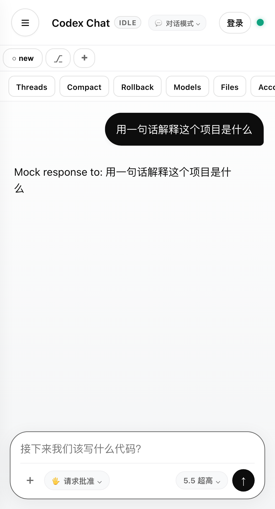
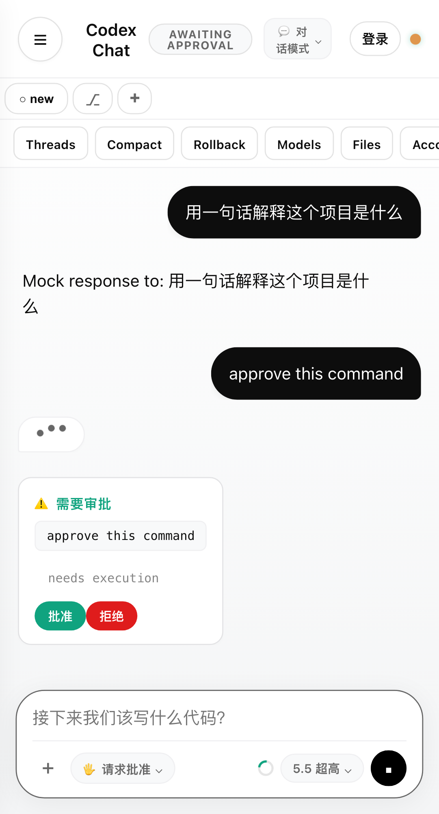

# codex-chat-mobile

[](https://github.com/Ike-li/codex-chat-mobile/actions/workflows/test.yml)
[](LICENSE)
[](package.json)

English | [简体中文](./README.zh-CN.md)

A mobile control plane for your local [Codex CLI](https://github.com/openai/codex). Codex keeps running on your dev machine; you drive it from your phone with a terminal-equivalent experience — same local workspace, same approval boundaries, same streaming agent events.

| Streaming chat | Approval card |
|---|---|
|  |  |

> Screenshots from the deterministic mock app-server (`npm run test:e2e` harness) — no real Codex tokens involved.

## Features

- Streaming conversations with the full agent event feed: text deltas, reasoning, command output
- Tool and command cards with exit codes, file-change summaries, and a visible raw-envelope fallback for unknown event types
- Approval cards — approve or deny exec/patch requests from your phone, mirroring Codex CLI approval policies
- Slash commands with suggestions (`/status`, `/diff`, `/review`, `/permissions`, …)
- File attachments: validated uploads stored owner-only, injected as safe local paths
- Session history backed by Codex's native session JSONL
- Multi-workspace routing (`WORK_DIR` + `WORK_DIRS` allowlist) and multi-instance tabs
- Web Push notifications (VAPID) and an installable PWA with mobile-safe layouts

## How It Works

```text
phone browser / PWA
  <-> Socket.IO
server.js  (Express 5: auth, routing, uploads, push, instance lifecycle)
  <-> CodexAppServerSession (agent-appserver.js)
  <-> stdio JSON-RPC 2.0
codex app-server
```

There is no hosted backend. The browser talks to a Node server on your dev machine, which drives a long-lived `codex app-server` process over stdio. See [docs/ARCHITECTURE.md](docs/ARCHITECTURE.md) for the full architecture and security model.

## Quick Start

Prerequisites:

- Node.js >= 20
- [Codex CLI](https://github.com/openai/codex) installed and authenticated (`codex` on `PATH`, or set `CODEX_BIN`); the protocol baseline is pinned to the version in `.codex-version`

```bash
npm install
cp .env.example .env
npm test
npm start
```

Open `http://127.0.0.1:3001` on the same machine. For phone access over LAN or a tunnel you must set `HOST=0.0.0.0` and a non-empty `AUTH_TOKEN`; with an empty `AUTH_TOKEN` the server is restricted to loopback.

## Configuration

| Variable | Default | Purpose |
|---|---|---|
| `PORT` | `3001` | HTTP port |
| `HOST` | `127.0.0.1` | Bind address; non-loopback requires `AUTH_TOKEN` |
| `AUTH_TOKEN` | empty | Shared secret for non-loopback access (timing-safe compare) |
| `WORK_DIR` | — | Primary Codex workspace |
| `WORK_DIRS` | empty | Comma-separated allowlist of extra workspaces |
| `CODEX_BIN` | `codex` | Path to the Codex CLI binary |
| `CODEX_APPROVAL_POLICY` | `on-request` | `untrusted` \| `on-failure` \| `on-request` \| `granular` \| `never` |
| `CODEX_SANDBOX` | `workspace-write` | `read-only` \| `workspace-write` \| `danger-full-access` |
| `CODEX_INPUT_QUEUE_LIMIT` | `20` | Max queued inputs during a busy turn |
| `IDLE_TIMEOUT_MS` | `600000` | Idle instance shutdown timeout |
| `VAPID_SUBJECT` / `VAPID_PUBLIC_KEY` / `VAPID_PRIVATE_KEY` | empty | Enable Web Push (all three required) |

## Commands

```bash
npm run lint            # ESLint
npm test                # unit / integration / protocol / security / doc contracts (node:test)
npm run protocol:check  # app-server protocol drift check against .protocol/stable/
npm run test:e2e        # Playwright mobile E2E against the mock app-server
npm run test:ci         # lint + tests + coverage gates + E2E
```

`npm run test:e2e` connects Playwright to `scripts/mock-server.js` — it never calls the real Codex CLI and never consumes model tokens.

## Security

- Empty `AUTH_TOKEN` → loopback-only; any LAN or tunnel deployment requires a strong token.
- Local state (device trust, uploads, audit logs) is written with owner-only permissions.
- CSP and frame protections; upload validation and size limits; log redaction for local paths and secrets.
- Destructive/Admin operations sit behind an unlock plus per-action confirmation.

This is a control plane for a real development machine — treat any remote exposure as high risk. See [SECURITY.md](SECURITY.md) for the threat model and how to report vulnerabilities.

## Key Files

- `server.js` — HTTP, Socket.IO, auth, routing, and instance lifecycle
- `agent-appserver.js` — Codex app-server JSON-RPC bridge and event mapping
- `public/index.html` — single-file mobile SPA/PWA: UI, approval cards, native panels
- `scripts/mock-codex-app-server.js` — deterministic Codex protocol mock for E2E
- `.protocol/stable/` — pinned app-server protocol baseline for drift checks

## Documentation

- [docs/GUIDE.md](docs/GUIDE.md) — end-to-end walkthrough from install to installing the PWA
- [docs/REMOTE_ACCESS.md](docs/REMOTE_ACCESS.md) — connect from your phone (HTTPS/PWA/Push constraints, Tailscale, tunnels)
- [docs/ARCHITECTURE.md](docs/ARCHITECTURE.md) — current architecture and security model
- [docs/PROTOCOL.md](docs/PROTOCOL.md) — Codex app-server protocol reference (methods, events, coverage)
- [docs/EVENTS.md](docs/EVENTS.md) — Socket.IO event contract index
- [docs/TESTING.md](docs/TESTING.md) — test gates, acceptance matrix, and manual smoke checklist
- [docs/PROTOCOL_UPGRADE.md](docs/PROTOCOL_UPGRADE.md) — Codex app-server protocol upgrade runbook
- [ROADMAP.md](ROADMAP.md) — shipped / in progress / candidates

The deep-dive docs are currently maintained in Chinese; translations are welcome. Documentation policy: only actively maintained documents are treated as sources of truth. One-off sprint plans and stale QA context are removed; the generative research drafts behind the protocol docs are kept read-only under [docs/archive/](docs/archive/) and clearly marked as unmaintained. Nothing from the archive should be re-promoted unless it is explicitly maintained again.

## Contributing

See [CONTRIBUTING.md](CONTRIBUTING.md). The project is TDD-first: write a failing test, make the minimal change, then run the four gates above. Issues and PRs are welcome in English or Chinese.

## License

[AGPL-3.0-only](LICENSE). If you run a modified version of this software as a network service, the AGPL requires you to offer the modified source to its users.
