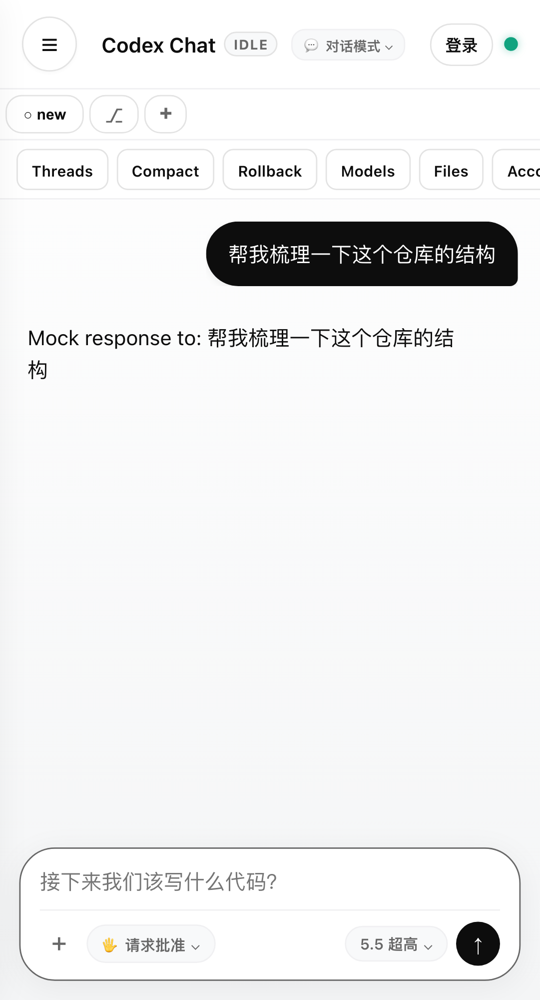
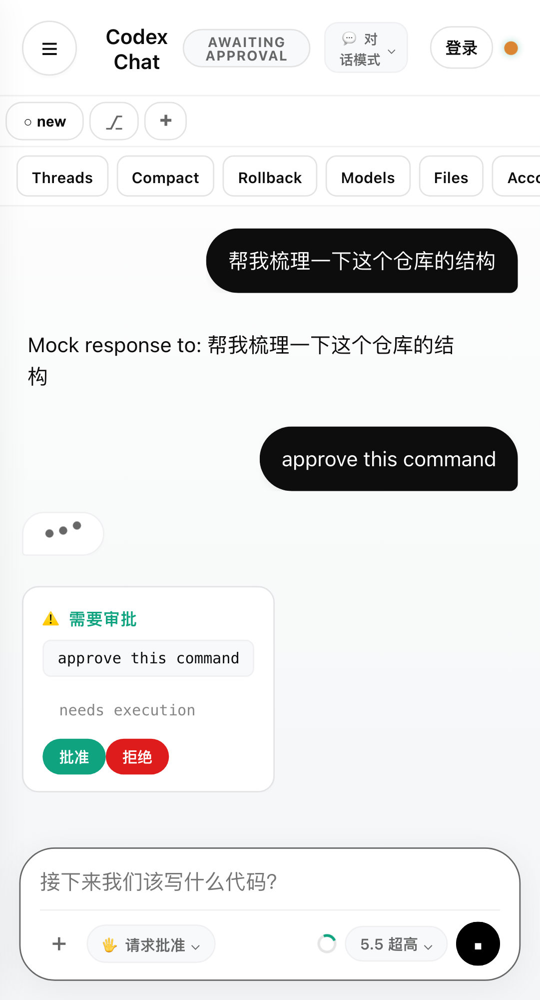
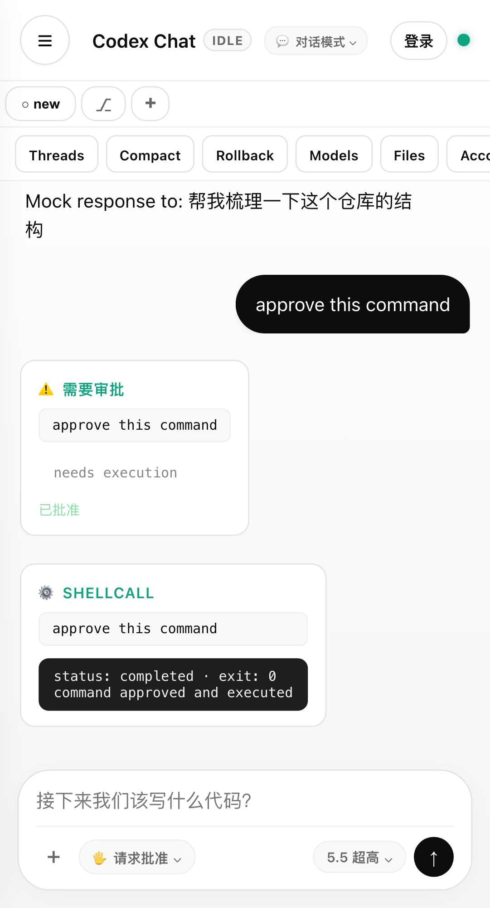
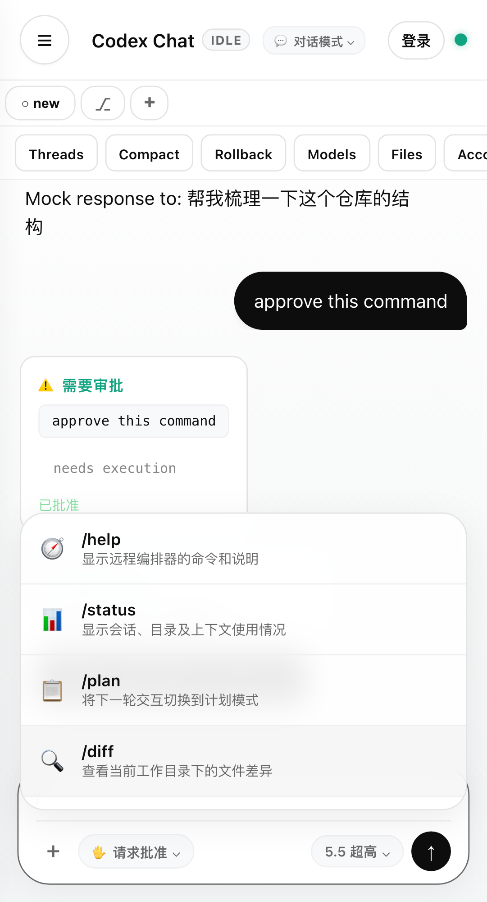
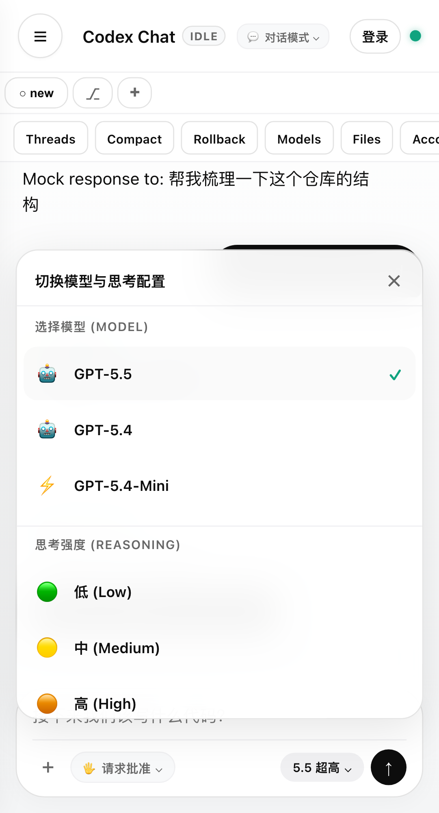
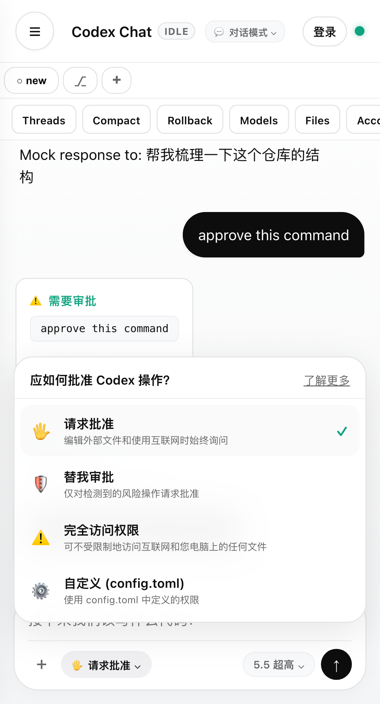
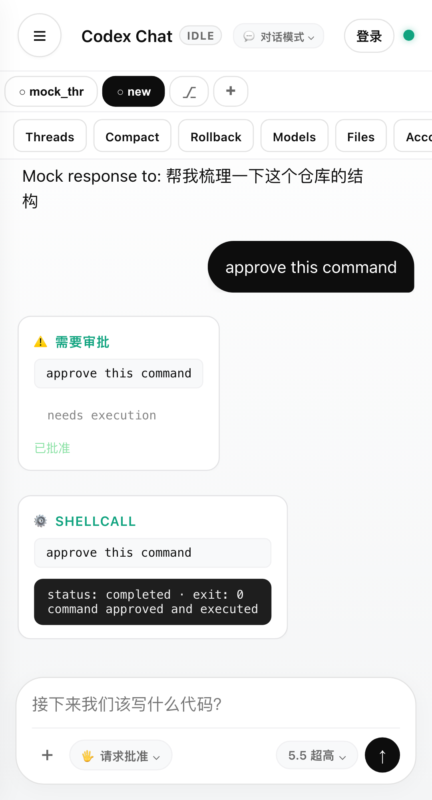
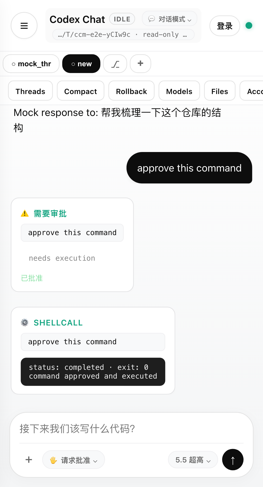

# 功能巡览

[English README](../README.md) · [中文 README](../README.zh-CN.md)

**codex-chat-mobile 是什么**：Codex CLI 跑在你的开发机上，这个项目让你从手机上像用终端一样驱动它——同一个工作区、同一套审批边界、同样的流式 agent 事件。下面用截图过一遍它到底能干什么。

> 所有截图取自确定性 mock app-server（`npm run test:e2e` 用的 harness），不调用真实 Codex、不消耗任何模型额度。真实使用步骤见 [GUIDE.md](GUIDE.md)。

## 流式对话

发一条提示词，助手回复以流式增量逐字出现，和终端里的体验一致。

## 命令审批

当 Codex 要执行命令或改文件时，手机上弹出审批卡片，显示将执行的命令和原因，由你决定批准还是拒绝——把终端里的 y/n 审批搬到锁屏可达的地方。

## 命令执行结果

批准后命令真正执行，结果以终端卡片呈现，带状态和退出码（`exit: 0`）；拒绝则不执行。

## 斜杠命令

输入 `/` 弹出命令建议，`/status`、`/diff`、`/review`、`/permissions` 等一应俱全，每条带说明，不用记。

## 模型与思考强度

一个弹窗切换模型（GPT-5.5 / 5.4 / 5.4-Mini）和思考强度（低 / 中 / 高），随时调整这一轮的算力投入。

## 审批策略与沙箱

在「请求批准 / 替我批准 / 完全访问权限 / 自定义」之间切换审批策略，配合沙箱模式控制 Codex 能碰什么——安全边界始终握在你手里。

## 多实例标签

用标签并行开多个对话，每个绑定自己的工作区和会话，互不串流；顶部一键新建、切换。

## 状态栏

点开头部即见当前工作目录、沙箱模式、审批策略、队列深度、会话与上下文用量——一眼掌握「现在在哪、能干啥」。

## 还有

native 控制面板（Threads / Models / Files / Account / MCP / Skills / 导入外部 agent 配置）、文件附件、会话历史抽屉、reasoning 分区渲染、Web Push、可安装 PWA。完整能力清单见 [../README.zh-CN.md](../README.zh-CN.md)，已交付/进行中/候选见 [../ROADMAP.md](../ROADMAP.md)。
