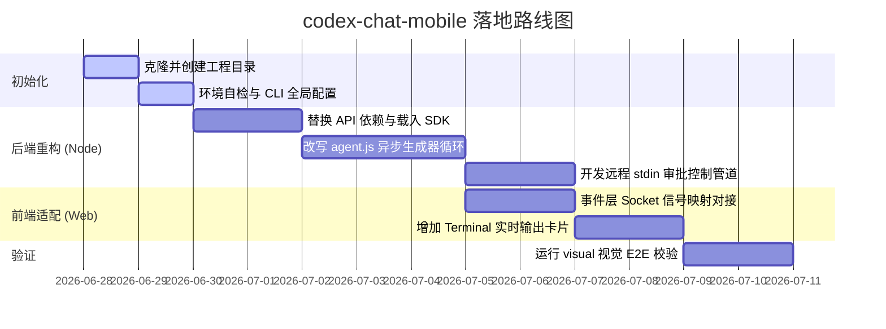

# Codex Chat Mobile (CCM-Codex) 深度调研与技术移植方案

> **方案设计模型：** Gemini 3.5 Flash  
> **方案目标：** 评估将 `claude-chat-mobile` 的“终端等价性 & 移动端安全控制”思路移植到 OpenAI Codex 生态的可行性，并给出具体的系统重构与技术落地路线。

---

## 一、 系统愿景与可行性评估

`claude-chat-mobile`（简称原项目）的核心设计哲学是**“一根默认上锁的透明管子”**：将本地开发环境、CLI、AI 智能体能力直接投射到移动端。其底层完全基于 Anthropic 的官方 CLI 与其 Agent SDK。

经过深度技术调研，该思路**完全可以 100% 移植到 OpenAI Codex 上**。两者在底层技术设计上呈现出极高的镜像对称性：

| 维度 | 原项目 (Claude-based) | 移植后项目 (Codex-based) | 对称性分析 |
| :--- | :--- | :--- | :--- |
| **运行时底座** | 本地已登录的 `claude` CLI | 本地已安装的 `codex` CLI | 均通过本地进程管道桥接，天然继承开发机的所有环境、登录态与工作目录。 |
| **开发者 SDK** | `@anthropic-ai/claude-agent-sdk` | `@openai/codex-sdk` (TypeScript) | 均提供了官方封装好的进程通信与 Agent 会话生命周期控制。 |
| **外部生态** | Model Context Protocol (MCP) | Model Context Protocol (MCP) | 两者均完美支持 MCP，本地的自建工具和第三方服务可以直接无缝复用。 |
| **安全控制** | 手机端指令审批 (Approve/Deny) | 基于 CLI 标准输入的远程指令拦截审批 | 均通过安全白名单结合挂起（Pending）机制，提供生产级的代码执行保护。 |

---

## 二、 架构设计与消息拓扑

在重构后的 `codex-chat-mobile` 中，整体通信拓扑与核心流向保持不变，仅需对**底层的 Agent 执行控制层**进行同构替换。

```mermaid
graph TD
    subgraph 移动端 (Browser UI)
        UI[public/ 单页 Web UI<br/>流式 Markdown · 工具状态卡片 · 审批弹窗]
    end

    subgraph 宿主机服务端 (Server)
        S[server.js<br/>Express 静态服务 + Socket.IO 契约层<br/>鉴权 · 设备信赖 · 事件分发]
        A[agent.js<br/>Codex 线程管理器 · 异步生成器循环]
    end

    subgraph 宿主机系统 (Local Host)
        SDK[@openai/codex-sdk]
        CLI[本机 codex CLI]
        Env[本地开发区 / .codex/config.toml / MCP 扩展]
    end

    UI <-->|"Socket.IO (agent:event 信封)"| S
    S <--> A
    A <-->|API 控制与事件监听| SDK
    SDK <-->|JSON-RPC via JSONL| CLI
    CLI <-->|执行| Env
```

---

## 三、 核心技术落地细节

### 1. 核心流式传输：从 EventEmitter 转换为 Async Generator

在原项目中，`agent.js` 利用 EventEmitter 订阅 SDK 事件。而 `@openai/codex-sdk` 采用现代的 **异步生成器 (Async Generator)**，需在 `agent.js` 的 `AgentSession` 实例中进行如下改写：

```typescript
// agent.js 核心重构示例
import { Codex } from "@openai/codex-sdk";

export class CodexSession {
  constructor(sessionId, workDir) {
    this.sessionId = sessionId;
    this.workDir = workDir;
    this.codex = new Codex();
    this.thread = null;
    this.isRunning = false;
  }

  async init() {
    // 自动加载本地/项目下的 .codex/config.toml 配置
    this.thread = this.codex.startThread({ cwd: this.workDir });
  }

  async sendQuery(query, onEventCallback) {
    if (this.isRunning) throw new Error("Agent is currently busy");
    this.isRunning = true;

    try {
      // 1. 调用 Codex 专属的流式运行接口
      const { events } = await this.thread.runStreamed(query);

      // 2. 用 for await 迭代异步生成器
      for await (const event of events) {
        // 3. 将其转换并向 Socket.IO 分发
        this.handleCodexEvent(event, onEventCallback);
      }
    } catch (err) {
      onEventCallback({ type: "error", payload: err.message });
    } finally {
      this.isRunning = false;
    }
  }

  handleCodexEvent(event, callback) {
    switch (event.type) {
      case "thread.started":
        callback({ type: "status", text: "Codex thread initialized..." });
        break;

      case "item.started":
        // 监控子任务的启动，如：命令执行、工具调用等
        callback({ type: "item_started", item: event.item });
        break;

      case "item.completed":
        // 监控子任务完成
        callback({ type: "item_completed", item: event.item });
        break;

      // 实时获取 Codex 智能体的文本回答流
      case "item/agentMessage/delta":
        callback({ type: "text_delta", text: event.delta });
        break;

      // 实时捕获本地 shell 命令执行的实时终端 stdout/stderr
      case "item/commandExecution/outputDelta":
        callback({ type: "terminal_stream", text: event.delta });
        break;

      case "turn.completed":
        callback({ type: "turn_completed", usage: event.usage });
        break;

      case "thread.error":
        callback({ type: "error", payload: event.error });
        break;
    }
  }
}
```

### 2. 危险操作远程拦截与双重审批

在 Codex 生态中，我们可以利用其内置的安全沙箱和确认控制机制来实现完全对称的“远程手机端审批”：

1. **启用 CLI 提示挂起：** 启动 SDK 时让其处于需要提示的模式（如配置 `--ask-for-approval on-request`）。当 Codex 执行超出安全域的操作时（如越过项目目录读写、调用外部网络等），底层 CLI 会在 stdin 抛出确认请求并挂起。
2. **事件上报与弹窗：** 当 SDK 检测到 `item.started` 中包含高风险的 `commandExecution` 或需要提权的操作时，Node 后端向手机推送一条事件封包，UI 弹窗展示完整命令及工作目录。
3. **确认/拒绝控制：**
   * **如果批准：** 手机端回传 `approve`，后端向 CLI 的 stdin 写入 `/approve` 或 `y\n` 回车，Codex 恢复执行。
   * **如果拒绝：** 手机端回传 `deny`，后端向 CLI stdin 写入取消指令，中断当前流程。

---

## 四、 第三方 Provider 与本地 OSS 模型支持

本移植方案极具吸引力的一点是：**Codex 提供了极其完备的第三方 API 代理和本地开源大模型（如 Ollama, LM Studio）支持。**

### 1. 全局与项目级配置文件映射

当使用 `@openai/codex-sdk` 时，配置将直接通过本地的配置文件（如项目根目录下的 `.codex/config.toml`）进行声明，SDK 会透明且天然地继承这些配置。

在 `codex-chat-mobile` 中，我们可以在项目初始化时，动态创建或自动填充 `.codex/config.toml`：

```toml
# ==========================================
# /Users/raylee/code/codex-chat-mobile/.codex/config.toml
# ==========================================

# 1. 默认使用的模型和 Provider ID
model = "gpt-5-codex"
model_provider = "custom-gateway"

# 2. 定义第三方 API 代理 / 兼容网关
[model_providers.custom-gateway]
name = "My Premium AI Proxy"
base_url = "https://your-custom-gateway-endpoint.com/v1"
env_key = "CODEX_CUSTOM_API_KEY"
wire_api = "responses"   # 必须使用 responses 协议以支持 Agent 的 Responses API

# 3. 亦或是直接定义本地离线大模型生态 (如 Ollama / LM Studio)
# 只要命令行附带 --oss，或未定义 cloud provider 时，将降级执行本地高安全级别的代码模型
oss_provider = "ollama"
```

> [!TIP]
> **关于 `wire_api = "responses"`**  
> 因为 Codex 内部复杂的任务规划和工具链追踪依赖于 OpenAI 极新的 Responses API，如果你的第三方中转网关只兼容传统的 `/v1/chat/completions`，可能会造成工具调用失效。请确保你的自建代理或购买的第三方 API 网关全面兼容或透传了 Responses API。

---

## 五、 移植落地路线图 (Migration Roadmap)



### 自动化验证与测试
* **单测：** 使用本地 mock 运行 `npm test` 对 `CodexSession` 基础事件封装进行单测。
* **冒烟测试：** 设置测试环境环境变量 `PORT=3100 node server.js`，运行专门编写的 `scripts/smoke-codex.js`，确保在局域网下，手机端能够流式接收到终端的每一行文本与命令执行回显。
