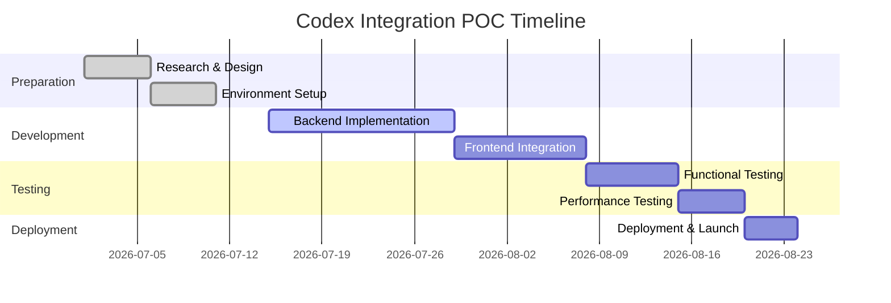

# Executive Summary  
The **claude-chat-mobile** project (Ike-li) is a self-hosted mobile UI that mirrors your local Anthropic Claude CLI on a phone. It uses a Node.js/Express backend (with Socket.IO) to forward user inputs to a running Claude agent and stream responses back, preserving the same tools, permissions, and session context as the CLI. Key techniques include real-time streaming, on-device tool approval, file/image upload, PWA optimizations, and strict auth (Cloudflare Access + token).  

This report analyzes how that design could be adapted to **OpenAI Codex**. It reviews codex’s official APIs, endpoints, and documentation, and compares the technical gaps. We find that many client-server and UI concepts (websockets, streaming, caching, PWA) are transferable, but Codex’s infrastructure differs: there is no direct “Codex Agent SDK” or local agent equivalent (though an official `codex` CLI exists), and code execution requires different tools. OpenAI’s **Responses API** (successor to completions) would be used to call Codex-type models in a multi-turn loop. This yields a similar conversational interface for coding. However, differences in authentication, rate limits, and built-in tooling require adaptation. 

Below is a detailed analysis of the repository, techniques, Codex documentation, and a proposed integration plan.  


## 1. Claude-Chat-Mobile Repository Summary  
The **claude-chat-mobile** repo provides a **mobile chat UI** for a local Claude Code CLI. It **does not include its own model**; instead it *“drives your local CLI”* and inherits your terminal’s CLAUDE.md, MCP skill set, logged-in session, provider, gateway, and model. In practice, a phone web client connects via HTTPS/WebSocket to a Node/Express server (typically on localhost:3000 or behind a Cloudflare tunnel). The server spawns/uses the local `claude` CLI through the **Anthropic Claude Agent SDK**. User messages are sent to `claude -p` via the SDK and responses are streamed back to the client.  

Key components (mapped to functions):  

| Component              | Function                                                           |
|------------------------|--------------------------------------------------------------------|
| **server.js**          | Express HTTP server + Socket.IO for websockets. Serves static UI, handles auth (CF Access or token) and session management. Performs versioned asset caching for PWA. |
| **agent.js**           | Manages Claude agent sessions via `@anthropic-ai/claude-agent-sdk`. Reads/writes the CLI, tracks conversation state, implements “AskUserQuestion” approval suspension, handles streaming and cancellation. |
| **cf-access.js**       | Integrates Cloudflare Access JWT verification and fallback auth token for incoming requests. |
| **sessions.js/history.js/statusline.js** | Track multi-session context, conversation history, and display metadata (model, tokens used) in the UI.  |
| **uploads.js/file-security.js** | Handle user file/image uploads, injecting safe code to read content (with path traversal protection). |
| **client (public/ directory)** | PWA front-end (HTML/CSS/JS) with service worker. Provides chat UI, streaming view, syntax highlighting, mobile-friendly design, and push notifications. Uses Socket.IO client to communicate. |

The data flow is: **Phone UI** → WebSocket/HTTPS → **Server** → Anthropic **Claude agent** → **Server** → **Phone UI**. The server enforces permissions: any CLI tool invocation not auto-approved by Claude’s own allow-list must pause and ask the user on the phone before proceeding. Files/images the user uploads are read by the server and passed into Claude via the agent’s file skills.  

The architecture (simplified) is:  

```mermaid
flowchart LR
    subgraph MobileClient [Mobile Client]
        M[Phone Browser / PWA UI]
    end
    subgraph Server [Backend (Node.js/Express)]
        S[Socket.IO & Express Server]
        DB[(Session DB/State)]
    end
    subgraph ClaudeAgent [Local Claude Agent (Anthropic)]
        C[Claude CLI via SDK]
    end
    M -- WebSocket (user messages) --> S
    S -- Drives CLI --> C
    C -- Streams reply --> S
    S --> DB
    S --> M
```  

Key technologies include Node.js (v20+), Express, Socket.IO (for live updates), the Claude Agent SDK (Anthropic) for headless CLI access, and standard PWA features (service worker, offline caching, push). The project also bundles utilities (e.g. `scripts/doctor.js` to validate setup) and uses libraries like JOSE (JWT), dotenv, and compression. All code runs locally (single-user). 

## 2. Core Techniques in Claude-Chat-Mobile  
The project’s primary techniques and patterns include:  

- **Client-Server Architecture:** A lightweight Node/Express backend with a static PWA front-end. Mobile browsers connect to the server’s REST endpoints and a persistent WebSocket. This decouples UI from model execution.  
- **Agent Interaction (Streaming):** The server uses the Anthropic *Claude Agent SDK* to launch or connect to a headless Claude CLI session. Messages from the client are sent as **query** calls, and tokens are streamed back. This achieves “terminal equivalence” – e.g. long outputs are streamed line-by-line, and markdown formatting is preserved.  
- **Prompt/Context Handling:** The system relays user messages and previous conversation turns to Claude as-is (no hidden prompt engineering). It supports multi-turn chat, multi-session contexts, and per-session model switching. System prompts and context are inherited from your existing `CLAUDE.md` and project files.  
- **Tool Calls & Permissions:** Claude Code supports invoking tools (e.g. running shell commands, file operations). The mobile UI displays any requested actions (e.g. `/shell git pull`) and allows the user to **confirm or abort**. Approved actions are executed on the host shell, capturing output back to chat. This is enforced by Claude’s own allow-lists, inherited from CLI settings.  
- **Mobile Optimizations:** The UI is a Progressive Web App. Static assets use versioned caching (immutable vendor, no-cache app.js) to minimize stale code. It uses push notifications for urgent approvals/results, iOS compatibility, and hides the token after first load. Layout is touch-friendly, and a status bar shows model/used tokens.  
- **Security/Trust Model:** By default the server only listens on localhost unless an auth token is set. Public deployment requires a randomly generated token or Cloudflare Access 2FA. The server enforces *per-device trust*: new devices get one-time approval. All CLI access is sandboxed via Claude’s permissions (no extra allow/deny rules are injected by the project).  
- **File/Image Upload:** Users can upload local files or images (e.g. a code snippet screenshot). The server enforces path sanity and then passes file contents (or image metadata) into the conversation.  
- **Other:** Status line shows live stats; markdown rendering with syntax highlighting; session history with names; download transcripts and logs (sanitized to 0600); dev conveniences (config checks, fixed domain deployment, etc.).

All together, the app replicates a rich CLI experience on mobile, leveraging Claude Code’s agent architecture.  

## 3. Applicability of These Techniques to OpenAI Codex  

**Model Interaction & SDK:**  Codex provides its own CLI and API, but not an open “agent SDK” like Anthropic’s. We would instead use OpenAI’s **Responses API** (or Codex-specific endpoints) via the official OpenAI SDK or `openai` CLI. The typical pattern would be `openai.responses.create({model, input, ...})` for each turn. This supports streaming output and multi-turn context. Unlike Anthropic’s Agent SDK, there is no need to “spawn a local process” if using the API, but we do need to manage conversation history ourselves. Alternatively, one could try to script the official `codex` CLI (runs in terminal) with a child process, but this is fragile.  

- *API Features Required:* The Responses API (or Chat Completions with Codex models, though Completions is being deprecated) must allow code-generation models. We would need multi-turn support (passing past turns) and streaming. OpenAI’s documentation confirms the Responses API handles complex coding use cases. It also includes optional *tooling* (web search, file search, code interpreter) that could emulate some “shell” operations. In the minimal case, **Codex CLI requires ChatGPT sign-in or an API key** (with appropriate permissions).  

- *Input/Output Formats:* Claude uses message arrays (role-content). The Responses API uses an “input” string or list of instructions, and returns an `output_text`. New responses use an “Item” based format (messages vs function calls). We would format user queries similarly to how the Claude CLI expects (likely natural language instructions about code tasks). The output is returned as text (code or explanation). We must also handle multimodal inputs if needed (images). Codex supports uploading files via the Files API (which can then be referenced by ID) or using the `file` upload parameter, but this is a different interface than Claude’s CLI inheritance.  

- *Rate Limits & Pricing:* Claude CLI usage is effectively unlimited under your Anthropic subscription quota. OpenAI Codex has **per-token pricing and limits**. For example, GPT-5.5 (via Codex) costs on the order of *\$1–\$30 per 1K tokens* (input vs output). There are also rate limits (e.g. requests per minute). We need to design around those (batching if possible). Latency will be higher since calls go to OpenAI’s servers (typical turn takes ~1-5s). The Responses API also now charges for any built-in tool token usage.  

- *Streaming:* OpenAI’s API supports streaming token-by-token (HTTP SSE or websocket). We can implement the same frontend streaming UI by listening to the streamed response.  

- *Code vs Chat:* Codex is specialized for code, but the interface is chat-like in the CLI. We can treat Codex just like Claude Code: e.g. send “**Explain this function**” or “**Refactor this code**”. The Responses API is essentially language-agnostic, but using a code-savvy model (gpt-5.x). Note: OpenAI’s older “Code” models (davinci-codex) are mostly superseded by GPT-5 family.  

- *Context Window:* OpenAI’s GPT-5.5 models have large context (likely tens of thousands of tokens). Still, we must implement our own context compaction if needed (OpenAI offers compaction strategies).  

- *Tokenization/Safety:* OpenAI and Anthropic have different tokenizers; but this only affects billing. For safety, Codex is governed by OpenAI’s content filters (moderation API), but these generally allow code queries. No special filtering is needed unless user content policies apply.  

- *Authentication:* Where Claude-mobile used CF Access + token, Codex requires an **OpenAI API key** (or login via ChatGPT account). The server can be configured with an API key in `.env`. No CF setup needed (though if hosting publicly, normal security applies).  

- *Tools & Shell:* One big gap is the “shell tool” support. Claude Code can run arbitrary shell commands (with approval). Codex CLI can also run commands (it has its own built-in shell skill, as shown in CLI docs). The API itself doesn’t run host shell commands; instead, you must emulate that via tools. OpenAI provides a **code interpreter tool** (like a Jupyter) and a **computer-use tool**. We could use these to run safe code or queries. For true shell-level access, one workaround is to implement a custom function: send a message to the API asking it to run code, then execute it server-side if approved. This is possible but requires careful sandboxing (high risk).  

- *Client-side Optimizations:* Caching static files, using a service worker, and status display are independent of the model. Those can be reused directly. Push notifications would work the same.  

In summary, **most UI/architecture patterns carry over**. The key differences are **the backend interface**: instead of Anthropic’s agent SDK feeding a CLI, we would call OpenAI’s Responses API (or spawn `codex` CLI) for each turn. The workflow becomes: **Client → Node Server → OpenAI API → Node Server → Client**.  


## 4. OpenAI Codex API and Documentation  

OpenAI provides extensive docs for Codex. Key points:  

- **Endpoints & Models:** Codex tasks use the **Responses API** (`POST /v1/responses`) with a coding model (e.g. `"gpt-5.5"` recommended). Legacy Chat/Completions endpoints are being **deprecated** for Codex models. The Responses API accepts JSON like `{"model":"gpt-5.5","input":"<your prompt>",...}` and returns an `output_text`. Code example: 
  ```python
  result = client.responses.create(
     model="gpt-5.5", 
     input="Fix the bug in this code...", 
     reasoning={"effort":"high"}
  )
  print(result.output_text)
  ``` 
  (similar Node.js or cURL examples are in the docs).  

- **SDKs and CLI:** OpenAI has official SDKs (Python, Node, etc.) that support the Responses API. There is also a dedicated **Codex CLI** that can be installed (`npm install -g @openai/codex` or via Homebrew). The CLI provides an interactive terminal interface, but can be scripted. It supports multi-turn chat and running code. For our integration, using the OpenAI Node/Python SDK is simplest. The **OpenAI CLI (`openai` command)** can also call the API from shell scripts. Documentation quality is high: guides, references, and code samples are abundant (see the Codex docs and API guides).  

- **Authentication:** All API calls require an API key (set in `OPENAI_API_KEY`). The Codex CLI offers a sign-in flow to a ChatGPT account (Plus/Pro/Enterprise plans include Codex). Using an API key means you’re on a pay-as-you-go or included quota plan.  

- **Rate Limits & Quotas:** The docs mention standard OpenAI quotas (tokens/minute). Codex (GPT-5.x) typically has high usage limits, but usage is billed by tokens. For instance, GPT-5.5 costs on the order of **\$1–\$30 per 1K tokens** (input vs output). Even smaller `gpt-5.3-codex` is \$1.75/\$14.00 per 1K tokens (input/output). These rates are much higher than Claude’s “covered by subscription”. Budgeting for API usage is crucial.  

- **Streaming & WebSocket:** The OpenAI Node SDK and Chat Completions API support streaming token-by-token (server-sent events). The Responses API also supports streaming outputs; this can be hooked to Socket.IO for real-time updates.  

- **Tools & Functions:** Responses API allows the model to use built-in tools (web search, code interpreter, file search, etc.) automatically. This can partially substitute for shell commands. Developers can also define custom functions (via function-calling support) for very controlled operations.  

- **Documentation:** OpenAI’s docs are organized and well-maintained. The **Codex docs** cover setup, model guidance, CLI usage, and examples. The **API reference** lists parameters for `responses.create`. Pricing and examples are clearly given. Overall, the technical documentation is comprehensive, though there is a learning curve around the new Responses API vs legacy completions.  

**Summary:** OpenAI’s Codex platform provides an API-centric interface (the Responses API) for coding tasks. Integration requires using their SDK or CLI, authenticating via key, and handling token-based pricing/limits. Most necessary features (streaming, function calls, file inputs) are supported, but work differently than Claude’s CLI approach.  


## 5. Feature Gaps, Adaptations, and Effort Estimates  

Below are major differences between Ike-li’s Claude approach and what Codex offers, with proposed workarounds:  

- **Local CLI vs API:** *Gap:* Claude-mobile leverages a local process (the Claude CLI) and agent SDK. Codex has an official CLI but no published SDK to control it. *Adaptation:* The simplest path is to **call the OpenAI API directly**. This means building backend code to send/receive JSON rather than driving a subprocess. Effort: *Medium.* (Rewriting agent.js to use `openai.responses.create` calls.) Risk: minimal – official SDK is stable.  

- **Shell Tool Execution:** *Gap:* Claude can execute arbitrary shell commands (with permission). OpenAI’s API cannot directly run the host shell. *Workaround:* Use the **Code Interpreter** or **Computer Use** tool: upload code/queries as prompt, let the model run computations. Or implement a custom function: e.g. when user asks to run a script, the server could run it after sending it to the model for approval. Effort: *High* (significant engineering and security review). Risk: *High* if unrestricted commands are allowed. Alternatively, drop this feature and only allow Codex’s built-in code tools (medium risk of losing parity).  

- **Permissions and Security:** *Gap:* Claude-mobile inherits Claude’s allow/deny lists for tools. Codex does not have user-defined CLI allow-lists. *Adaptation:* We must implement our own approval UI. For example, whenever the API response suggests a file operation, prompt the user on phone (similar to Claude-mobile). Effort: *Low* (reuse UI pattern). Risk: *Medium* – incorrect parsing could execute something unsafe. Strong sanitization needed.  

- **Session & State Storage:** *Gap:* Claude agent holds session history. Responses API is stateless (unless using `store:true`). *Adaptation:* The server should store past turns and re-send as “input” or use the statefulness feature of Responses. Effort: *Low–Medium.* Risk: *Low.*  

- **Multi-Repo/Workdir:** *Gap:* Claude sessions can switch working directories (since it’s running in a shell). Codex’s API has no notion of filesystem. *Adaptation:* Unavailable. We could simulate by uploading different code context or by running in separate sessions. Effort: *High.* Risk: *Medium.* Might skip multi-dir support.  

- **Input/Output Formats:** *Gap:* Claude-mobile’s UI formats code blocks, diffs, etc. Codex outputs should be handled similarly. The back-end must detect code vs text. *Adaptation:* Continue rendering markdown with syntax highlighting; Codex’s output can be displayed in the same chat UI. Effort: *Low.* Risk: *Low.*  

- **Libraries & Dependencies:** Node dependencies remain similar (Express, websockets). Replace `@anthropic-ai/claude-agent-sdk` with `openai` SDK (Node). Effort: *Low.*  

- **Rate/Limits Handling:** *Gap:* Claude’s local CLI has essentially no request rate limit. OpenAI has quotas. *Adaptation:* We may need to throttle, or inform user of rate limits. Possibly batch messages. Effort: *Low.* Risk: *Low.*  

- **Latency:** OpenAI calls add network latency. *Adaptation:* Use streaming to the UI and show progress indicators. Effort: *Low.*  

- **Documentation & Support:** Codex’s docs are extensive, so missing info should be rare. No significant gap here.  

In sum, **engineering effort is medium** overall. Replacing the agent integration is the bulk of work. Realizing shell tool support is the biggest technical challenge (effort high, risk high). If necessary, we might compromise by offering only Codex’s built-in tools or dropping some CLI fidelity.  

  

## 6. Implementation Plan  

**Overview:** Develop a proof-of-concept (POC) mobile chat interface for Codex by repurposing the claude-chat-mobile frontend and writing a new backend that uses OpenAI’s API. Steps:  

1. **Environment Setup (Week 1):** Obtain an OpenAI API key with Codex access. Set up Node.js v20+. Install OpenAI SDK (`npm install openai`) and basic project scaffolding (copy claude-chat-mobile code as template). Test trivial API call to make sure authentication works.  
2. **Backend Core (Weeks 2–3):** Replace `agent.js` logic: on user input, call `openai.responses.create({model: chosenModel, input: userText, stream: true})`. Stream tokens back over Socket.IO. Handle endpoints for actions (e.g. file upload -> use OpenAI Files API or embed content in prompt). Implement a state store for conversation history.  
3. **UI Integration (Weeks 3–4):** Use the existing PWA UI; modify any branding/labels from “Claude” to “Codex”. Ensure the UI decodes and displays streaming tokens from the new backend. Implement the permission prompt: if the model’s output contains e.g. a function_call hinting to run code, pause and ask the user (like `AskUserQuestion`).  
4. **Testing (Week 5):** Functional tests: automate sending prompts and verifying responses. Test with known coding tasks. Performance tests: measure API latency, ensure UI remains responsive.  
5. **Iteration (Week 6):** Evaluate feature parity. If shell tool is needed, experiment with the `code-interpreter` mode or custom server execution (with heavy sandboxing). Validate security (e.g. no arbitrary eval).  
6. **Proof-of-Concept Demo (Week 7):** Deploy the server locally (or on a server with secure token). Use a Cloudflare tunnel or similar to test on an actual phone. Prepare sample API call snippets for documentation.  

**Milestones:**  

| Milestone               | Tasks                                        | Duration   |
|-------------------------|----------------------------------------------|------------|
| **M1. Setup & Research**        | OpenAI API key, prototypes (Hello World call) | 1 week     |
| **M2. Backend Prototype**       | Develop API call loop; streaming to client    | 2 weeks    |
| **M3. Frontend Integration**    | Connect UI, handle messaging, UI tweaks       | 2 weeks    |
| **M4. Permission Logic**        | Implement user-approval UI for actions        | 1 week     |
| **M5. Testing & Refinement**    | Functional tests, performance tuning          | 1 week     |
| **M6. Demo & Documentation**    | Sample calls, POC presentation                | 1 week     |



Sample API call (Node.js SDK):  
```js
const { OpenAI } = require("openai");
const client = new OpenAI();
let res = await client.responses.create({
  model: "gpt-5.5", 
  input: "Review this code: function f(x) { return x**2; }",
  reasoning: { effort: "high" },  // optional; instruct model to be thorough
  stream: true
});
res.on("data", chunk => socket.emit("codex_response", chunk.text));
```
This demonstrates using the Responses API with streaming tokens.  

**Resources:** Requires an OpenAI account with Codex access (Plus/Pro or API). The Node server needs only moderate CPU (all heavy work is API calls). Additional resources: test code examples, maybe local sandbox (Docker) if implementing any shell emulation.  

**Estimated Effort:** ~6–8 weeks of work by a small engineering team (1–2 devs). Major risks involve securely handling any execution of code or system commands.  


## 7. Tests, Metrics, and Validation  

To ensure quality, the following should be implemented:  

- **Functional Tests:** Write unit tests for the backend API interface (mock the OpenAI client). Ensure that given a user message, the correct API call is made. Integration tests: simulate a user session end-to-end (client sends “Hello”, backend forwards, returns text). Use known prompts and verify the correctness of answers or code fixes.  
- **Performance Metrics:** Measure **latency** (time from user send to first reply token). Target <3s if possible (GPT-5.5 can be fast). Measure **throughput** for concurrent users. Monitor API usage (tokens per session, cost). Ensure socket timeouts and reconnects work gracefully.  
- **Safety & Security Tests:** If any code execution is implemented, test for sandbox escapes (e.g. malicious code injection). Verify that uploads are sanitized (no path traversal). Confirm that unauthorized users cannot connect (test with missing/invalid token).  
- **UX Validation:** Test on actual devices (Android/iOS browsers). Check push notification permissions and flows. Verify the UI is readable (accessibility).  
- **Evaluation Metrics:** Depending on use-case, one could measure *coding quality* (does Codex-generated code pass unit tests?), but for the POC we focus on stability and parity: e.g., “Equivalent commands execute correctly” and “Approved actions appear on UI before execution.”  

Additionally, log all interactions (sanitized) to audit any misbehavior. Since Codex operates via a cloud API, also check for cases like rate-limit errors and handle them (retry with backoff).  

Each feature (chat, tool-run, upload) should have test cases. For example: send a request to run a safe shell command (like `ls`) and verify the response only occurs after an explicit “Approve” click.  

By systematically testing each component, we can ensure functional completeness and surface any dangerous cases before wider deployment.  


## 8. Diagrams 

The diagram below shows the intended integration architecture between the mobile client, the backend server, and the OpenAI Codex service. The phone UI communicates with the Node/Express server over HTTPS/WebSockets; the server in turn calls the OpenAI **Responses API** (or local codex CLI) and streams results back to the client:  

```mermaid
flowchart LR
    subgraph MobileClient [Mobile Client (PWA)]
        M[Phone Browser UI]
    end
    subgraph Server [Backend (Node.js/Express)]
        S[Express & Socket.IO]
        DB[(Session Storage)]
    end
    subgraph CodexService [OpenAI Codex]
        API[Codex API (Responses)]
    end
    M -- WebSocket (chat messages) --> S
    S --> DB
    S -- REST/streaming calls --> API
    API -- stream results --> S
    S --> M
```

And the timeline Gantt chart above outlines the development milestones and schedule for the proof-of-concept implementation.  

**Sources:** The Claude mobile design is documented in its [README](https://github.com/Ike-li/claude-chat-mobile#readme). OpenAI Codex information is drawn from the official [Codex docs](https://developers.openai.com/codex) and [API guides](https://developers.openai.com/api/docs), and pricing is from OpenAI’s pricing page. These sources provide the details used in the analysis above.